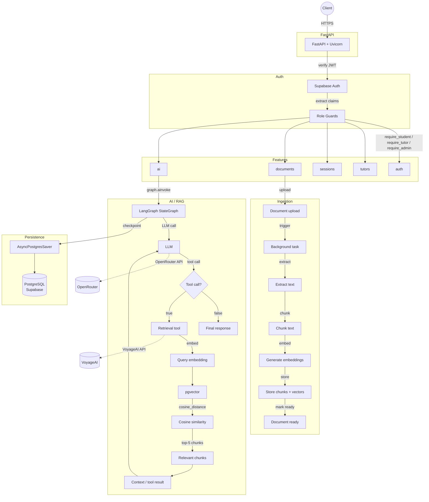

# CampusIQ Backend

FastAPI backend for CampusIQ, an educational platform combining tutor discovery, session booking, document ingestion, and document-grounded AI assistance via Retrieval-Augmented Generation (RAG). The backend implements a full async application stack: PostgreSQL/pgvector for relational and vector data, Alembic for scehma migration LangGraph for stateful RAG orchestration, Supabase Auth for identity, VoyageAI for embeddings, and OpenRouter for LLM inference.

---

## Engineering Highlights

- Implements JWT-based authentication via Supabase with composable FastAPI RBAC dependencies (`require_student`, `require_tutor`, `require_admin`)
- Builds a document-grounded RAG pipeline: PyMuPDF extraction → RecursiveCharacterTextSplitter chunking → VoyageAI embeddings → pgvector cosine similarity retrieval → LangGraph tool-calling loop
- Uses LangGraph `StateGraph` with conditional edges for stateful LLM workflow, persisted via `AsyncPostgresSaver` with `MemorySaver` fallback
- Processes document ingestion asynchronously via FastAPI `BackgroundTask` with a dedicated async engine, explicit failure handling, and status tracking
- Enforces cursor-based pagination on append-only AI message data to avoid offset drift
- Organizes the backend by business domain with routes, models, schemas, and services co-located per feature module

---

## Architecture



---

## Tech Stack

| Component | Technology | Role |
|---|---|---|
| API | FastAPI | Async HTTP API |
| Database | PostgreSQL + pgvector | Relational + vector storage |
| ORM | SQLAlchemy + SQLModel | Data access |
| Auth | Supabase Auth | JWT identity |
| AI | LangGraph + OpenRouter | LLM workflow |
| Embeddings | VoyageAI | 1024-dim vectors |
| Processing | FastAPI BackgroundTasks | Document ingestion |
| Migrations | Alembic | Schema migrations |
| Cache | Redis/Upstash | Configured, not active |

---

## Project Structure

Each feature is organized as a self-contained module with its own related models, routes, schemas, and services. This feature-oriented structure keeps business logic close to the domain it serves, reduces coupling between unrelated areas, and keeps the repository modular as the application grows.

```
app/
├── main.py
├── api.py
├── core/
│   ├── config.py
│   ├── supabase.py
│   ├── celery.py           # Legacy Celery stub
│   └── tool_gate.py
├── db/
│   ├── base.py
│   └── session.py
├── common/
│   └── enums.py
├── features/
│   ├── auth/
│   ├── tutors/
│   ├── sessions/
│   ├── documents/
│   ├── ai/
│   │   ├── chat/
│   │   ├── graph.py
│   │   ├── state.py
│   │   ├── tools.py
│   │   └── rag/
│   ├── students/
│   ├── chats/              # Models only; routes not registered
│   ├── payments/
│   ├── reviews/
│   ├── moderation/
│   └── audit/
alembic/
```

---

## Core Flows

### API Request Lifecycle

```text
HTTP Request → CORS → Supabase JWT Verification → Role Guard → Route Handler → Service → SQLModel/SessionDep → PostgreSQL → Pydantic Response
```

### Document Ingestion Pipeline

```text
POST /documents
    ↓
create_document() → persist Document (status=processing)
    ↓
BackgroundTask: upload_document_task(document_id, file_url)
    ↓
HTTP response returned immediately
    ↓
1. extract_pdf_pages() — PyMuPDF via httpx
    ↓
2. create_chunks() — RecursiveCharacterTextSplitter (500 chars, 50 overlap)
    ↓
3. generate_embeddings() — VoyageAI (voyage-4, 1024-dim)
    ↓
4. save_chunks() — Insert DocumentChunk + pgvector vectors
    ↓
Document.status → "ready" (or "failed" on error)
```

The background task creates its own async engine, runs the pipeline, marks the document failed on error, and disposes the engine in `finally`. Tasks are not durable — a crash loses in-progress work.

### AI/RAG Conversation Flow

```text
POST /ai/chat → LangGraph graph.ainvoke({messages, conversation_id, document_id})
    ↓
Chat Node: LLM call (OpenRouter)
    ↓
tool_gate.py: document_id present OR doc-trigger keywords → tool_choice="required"
    ↓
tools_condition → Tools Node → search_document / search_document_by_name
    ↓
pgvector cosine_distance(query_embedding) LIMIT 5 → top-5 chunks
    ↓
Retrieved chunks → LLM prompt context → LLM response
    ↓
Loop until final answer → Save AIMessage + increment AICredit
```

---

## API Surface

| Domain | Core Endpoints | Description |
|---|---|---|
| **Auth** | `GET /auth/me`<br>`GET /auth/profile`<br>`POST /auth/sync-user` | Authenticates users, retrieves profile information, and synchronizes Supabase users with local records. |
| **AI** | `POST /ai/chat`<br>`GET /ai/conversations` | Provides LangGraph-powered RAG chat and cursor-paginated conversation history. |
| **Documents** | `GET /documents/`<br>`POST /documents/`<br>`GET /documents/{id}`<br>`GET /documents/{id}/status`<br>`DELETE /documents/{id}` | Manages document uploads, asynchronous ingestion, retrieval, processing status, and deletion. |
| **Tutors** | `POST /tutors/profile`<br>`GET /tutors/profile`<br>`PATCH /tutors/profile`<br>`GET /tutors/search`<br>`GET /tutors/{id}` | Supports tutor onboarding, profile management, filtered tutor discovery, and public profile access. |
| **Sessions** | `POST /sessions/`<br>`GET /sessions/{student\|tutor}`<br>`PATCH /sessions/{id}/accept\|decline\|cancel\|start\|end`<br>`POST /sessions/{id}/review` | Handles tutoring session creation, role-based listing, lifecycle transitions, and post-session reviews. |
| **Students/Admin** | `GET /students/{id}/dashboard-stats`<br>`GET /admin/welcome`<br>`GET /health` | Provides student dashboard statistics, the admin entry point, and the unauthenticated health check. |

Key decisions: separate response schemas; cursor-based pagination for append-only AI message history, offset pagination for tutor search; tutor search supports subject/rate/rating filters; `POST /auth/sync-user` is idempotent.

---

## Authentication & Authorization

Supabase handles identity and JWT issuance. On every protected route, the backend extracts the Bearer token via `HTTPBearer`, calls the Supabase Auth API to validate it and fetch the user, then maps that Supabase user to the local `User` record in PostgreSQL. If the local user doesn't exist or is inactive, a `404` or `403` is returned respectively.

Role-based access is enforced through composable FastAPI dependencies (`require_student`, `require_tutor`, `require_admin`) that chain on top of `get_current_user`. Each guard checks `user.role` against the required enum and raises `403` with a descriptive message on mismatch. The dependencies compose cleanly — for example `require_student` wraps `get_current_user`, so routes can simply `Depends(require_student)` to restrict access.

The `POST /auth/sync-user` endpoint maps Supabase metadata (email, role, etc.) into the local `User` model, and is idempotent — calling it multiple times is safe.

The `refresh_tokens` table exists in the database, but a complete rotation/revocation flow is not yet implemented.

---

## AI & RAG

`ChatState(MessagesState)` adds `conversation_id` and `document_id`. The graph loops between a `chat` node (LLM) and a `tools` node (retrieval) via `tools_condition` until the LLM produces a final answer.

**Document-grounded chat**: When `document_id` is present, `tool_choice="required"` is applied and the prompt is scoped to the document. `tool_gate.py` detects document-related keywords to trigger retrieval without an explicit `document_id`.

> Grounding depends on the LLM following retrieval context, not an absolute guarantee.

**Retrieval tools** create their own `AsyncSession` and return `{"error": "..."}` dictionaries rather than raising.

**Persistence**: When the graph initializes, it creates a persistent `AsyncPostgresSaver` using `conversation_id` as the thread ID — so every message in a conversation is checkpointed to PostgreSQL and survives service restarts. If the saver fails to connect, it falls back to `MemorySaver`, which keeps the conversation alive for the current session but loses all state on restart.

**LLM**: OpenRouter (`openrouter/free`), bound with `tools=[search_document, search_document_by_name]`, initialized at module load if `OPENROUTER_API_KEY` is set.

---

## Database & Data Modeling

PostgreSQL + pgvector; connections use `asyncpg`.

| Table | What it stores |
|---|---|
| **`users`** | Core identity — `role` enum (`student`/`tutor`/`admin`), `email` unique, name fields, `email_verified`, `is_active`, `last_seen_at` |
| **`ai_conversations`** | One conversation per user (`unique` on `user_id`); stores the LangGraph thread ID used for state checkpointing |
| **`ai_messages`** | Append-only chat history per conversation — `role` (user/assistant), `content`, optional `document_id` grounding the response, `citations` JSONB |
| **`ai_credits`** | Per-user daily usage tracking — `used_today` and `daily_limit` (default 30); enforcement is currently commented out |
| **`documents`** | Files uploaded by users — `status` (`processing`/`ready`/`failed`), `file_url`, optional `conversation_id` and `course_id`; supports full-text search |
| **`document_chunks`** | Chunked text with pgvector embeddings (`Vector(1024)`) — unique on `(document_id, chunk_index)`, each chunk stores its page number and raw text |
| **`tutor_profiles`** | Tutor-specific data — one-to-one with `User`, M:N with `Course` via `TutorCourse` join table |
| **`sessions`** | Scheduled tutoring sessions — `status`, `scheduled_at`, `cost`, `meet_link`, timestamps |
| **`reviews`** | Post-session reviews submitted by students |
| **`rooms`/`messages`** | Data models exist; routes not registered |

---

## Engineering Decisions

**FastAPI BackgroundTasks over Celery** — Celery was considered, but deploying it would require a separate paid worker instance. FastAPI `BackgroundTasks` was chosen to avoid that additional deployment cost and infrastructure while keeping document ingestion asynchronous. The trade-off is that background tasks do not provide durable execution or retries. `app/core/celery.py` is retained as a legacy stub.

**PostgreSQL + pgvector instead of a dedicated vector DB** — eliminates an infrastructure component; relational and vector data joinable in a single query. Trade-off: may not scale for large vector-search workloads.

**Async SQLAlchemy** — all I/O-bound operations use async/await on a single Uvicorn worker.

**LangGraph + AsyncPostgresSaver** — the LLM → tools → LLM flow maps naturally to a state machine; `AsyncPostgresSaver` persists graph state across restarts.

**Feature-oriented structure** — domain modules co-locate routes, models, schemas, and services per business domain.

**Two pagination strategies** — the choice depends on the data shape. AI messages use **cursor-based pagination** on `created_at` (UUID cursor, backward-read) to avoid offset drift on an append-only log. Tutor search uses **offset-based pagination** (`limit`/`offset` params) since results are filterable and non-monotonic. See `app/features/ai/chat/service.py` and `app/features/tutors/service.py` respectively.

---

## Setup

```bash
python -m venv venv && source venv/bin/activate
pip install -r requirements.txt
alembic upgrade head
uvicorn app.main:app --host 0.0.0.0 --port 8000 --reload
```

Required env vars: `DATABASE_URL`, `DIRECT_URL`, `LANGGRAPH_URL`, `SUPABASE_URL`, `SUPABASE_SERVICE_ROLE_KEY`, `SUPABASE_ANON_KEY`, `SUPABASE_JWT_SECRET`, `OPENROUTER_API_KEY`, `VOYAGEAI_EMBEDDER_KEY`. Optional: `REDIS_URL`, `LOG_LEVEL`. The `.env` file is gitignored.

Linting: `ruff check . && black . && isort . && mypy .` — API docs at `http://localhost:8000/docs`. Authenticated endpoints use `Authorization: Bearer <token>`.

---

## Limitations

- **BackgroundTasks**: selected over Celery because a separate paid worker instance was not available for deployment; no durable execution or retries
- **Automated tests/CI**: not implemented
- **AI citations**: schema exists, not populated
- **AI credit enforcement**: disabled
- **Realtime chat**: routes/WebSockets not registered
- **Refresh-token rotation/revocation**: incomplete
- **Docker/deployment manifests**: absent

---

## License

This project is part of the CampusIQ portfolio.
